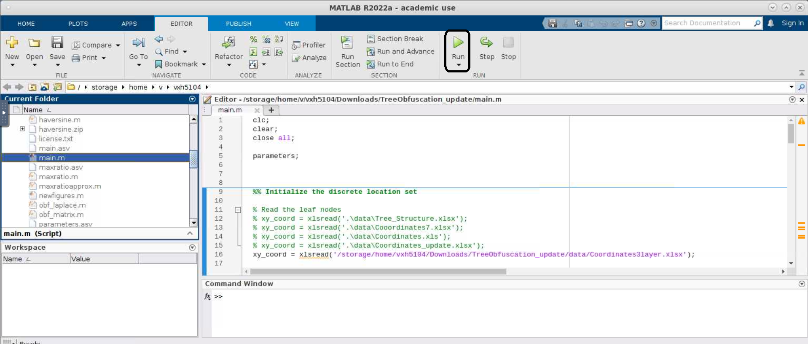

# CORGI #

Main repository for "CORGI: User Customizable and Robust Geo-Indistinguishability for Location Privacy"

## Brief Intro ##

CORGI ( Cust Omizable Robust Geo Indistinguishability), a framework for generating location obfuscation with strong privacy guarantees (based on Geo-Ind) that effectively allows users to balance the trade-off between privacy, utility, and customization. CORGI utilizes an untrusted server for performing the computationally heavy task of generating the obfuscation function while ensuring the privacy of the user.

<br />


## Repository Structure ##

```bash
├── Code
│   ├── haversine.m              * Calculates haversine distance between two locations.
│   ├── main.m                   * Execute this code to generate output file.
│   ├── parameters.m             * Set the values of various privacy parameters.
│   └── robust_obf_matrix2.m     * Generates robust obfuscation matrix depending on the input parameters.
├── Data
│   ├── Coordinates3layer.xlsx   * Latitude and Longitude values of 1 Parent node, 7 nodes in height-1, 
                                   49 nodes in height-2 and 343 nodes in height-3. 
│   └── prior_prob_343.mat       * Prior probability of all the 343 leaf nodes of the tree.
├── Results
└── README.md
```
## Code Guide ##

1. Install the MATLAB if it is not installed in your system.
2. Update the values of the parameter.m (In Code directory) file. <br />
    a. NR_TASK - Number of Target location. <br />
    b. NR_LOC * NR_LOC_Mul - Total number of coordinates in the tree.(NR_LOC=49, Alter the total number of nodes in Tree 
                             by changing the value of NR_LOC_Mul ). <br />
    c. EPSILON - Privacy budget. <br />
    d. EPSILON_FIRST - Intial value of EPSILON. <br />
    e. EPSILON_LAST - End value of EPSILON. <br />
    f. EPSILON_INCR - Increment value for loop. <br />
    g. DELTA - Number of locations to be pruned. <br />
    h. DELTA_FIRST - Intial value of DELTA. <br />
    i. DELTA_LAST - End value of DELTA. <br />
    j. DELTA_INCR - Increment value for loop. <br />
4. Select the main.m file and execute it by clicking "RUN" in MATLAB (In Code directory).

   
  
5. After execution is completed, 5 .mat file will be saved in Results directory. <br />
    a. z_fval.mat  * Objective value (average estimation error of traveling cost) achieved by non-robust matrix <br />
    b. z_fval_robust.mat  * Objective value (average estimation error of traveling cost) achieved by CORGI <br />
    c. z_robust_diff.mat * Difference between the objective value in consecutive iterations achieved by  CORGI<br />
    d. nr_violates1.mat  * Average number of Geo-Ind constraint violations in non-robust matrices<br />
    e. nr_violates2.mat  * Average number of Geo-Ind constraint violations in CORGI matrices<br />

## Correspondence ##

📬 Primal Pappachan [📜](mailto:primal@psu.edu) [Homepage](https://primalpappachan.com/)<br />
📬 Chenxi Qiu [📜](mailto:chenxi.qiu@unt.edu) [Homepage](https://computerscience.engineering.unt.edu/people/faculty/chenxi-qiu)<br />
📬 Anna Squicciarini [📜](mailto:acs20@psu.edu) [Homepage](https://faculty.ist.psu.edu/acs20/)<br />
📬 Vishnu Sharma Hunsur Manjunath [📜](mailto:vxh5104@psu.edu) [Homepage](mailto:vxh5104@psu.edu)<br />

## License

[BSD-3-Clause License](https://choosealicense.com/licenses/bsd-3-clause/)
